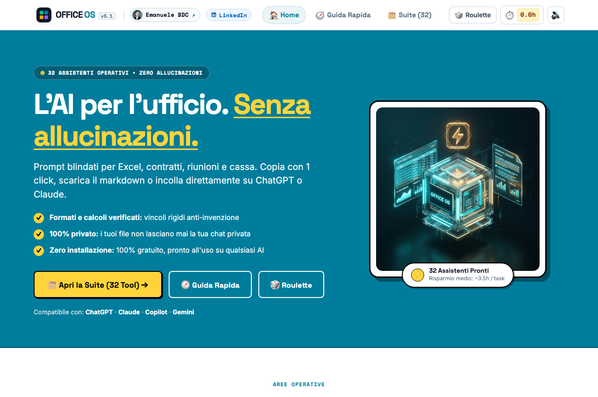

# ⚡ OFFICE OS — L'AI per l'ufficio. Senza allucinazioni.

> 🌐 **Prova subito la suite online:** [**emaf205.com/ideas/office-os**](https://emaf205.com/ideas/office-os)  
> 💡 **Progetto Open-Source & 100% Gratuito:** Zero abbonamenti, nessun account richiesto, 100% privato nel browser.

---

  

---

## 🎯 Cos'è OFFICE OS?

**OFFICE OS** è una suite operativa open-source creata per trasformare l'Intelligenza Artificiale in uno strumento di lavoro pratico, affidabile e immediato per chi lavora ogni giorno in ufficio.

Basta prompt generici che inventano dati o danno risposte vaghe: i **32 assistenti** di OFFICE OS sono istruzioni specializzate e strutturate per svolgere compiti operativi reali in pochi secondi su qualsiasi modello (ChatGPT, Claude, Copilot o Gemini).

### ✨ Caratteristiche Principali

- 🛡️ **Zero Allucinazioni:** Ogni prompt contiene vincoli anti-invenzione e istruzioni rigide di verifica (se un dato manca, l'AI lo segnala invece di inventarlo).
- ⚡ **Copia in 1 Click:** Scegli il tool, tocca **Copia Prompt** e incollalo nella tua chat AI abituale con i tuoi file o testi.
- 🔒 **100% Privacy & Sicurezza:** Nessun dato aziendale o personale viene raccolto, salvato o inviato a server esterni. L'applicazione funziona al 100% nel tuo browser.
- 📱 **Funziona Offline (PWA):** Puoi installarla su iPhone, Android, Mac o Windows direttamente dal browser e usarla ovunque, anche in aereo o senza connessione internet.

---

## 🗂️ Le 4 Aree Operative (32 Tool Inclusi)

1. 📊 **Fogli & Dati (8 Tool):** Pulizia automatica tabelle, audit formule, estrazione KPI, riconciliazione tra due fogli, previsioni di cassa e analisi budget.
2. 📄 **Contratti & Documenti (8 Tool):** Scadenzari vincoli, slide pronte per CDA, sintesi direzionali di report lunghi, bozze preventive e contratti fornitore.
3. 🎯 **Task & Progetti (8 Tool):** Da email caotica a lista to-do con priorità, pre-mortem dei rischi, procedure operative standard (SOP) e piani di progetto.
4. 🤝 **Meeting & Decisioni (8 Tool):** Verbale e compiti da trascrizioni, matrici di comparazione decisionale, domande scomode prima di una riunione chiave e risposte a reclami.

---

## 🌐 Provalo Subito

Non devi installare nulla sul tuo computer. Puoi aprire la suite completa direttamente online:

👉 [**https://emaf205.com/ideas/office-os**](https://emaf205.com/ideas/office-os)

---

## 👤 Autore & Contatti

Ideato e sviluppato con passione da **Emanuele BDC**:

- 🔗 **Linktree:** [linktr.ee/emaf205](https://linktr.ee/emaf205)
- 💼 **LinkedIn:** [linkedin.com/in/emanuelebdc](https://www.linkedin.com/in/emanuelebdc/)
- 🌐 **Sito Web:** [emaf205.com](https://emaf205.com)

---

## 📄 Licenza

Questo progetto è distribuito sotto licenza **MIT Open Source** — libero per uso personale, aziendale e professionale.
